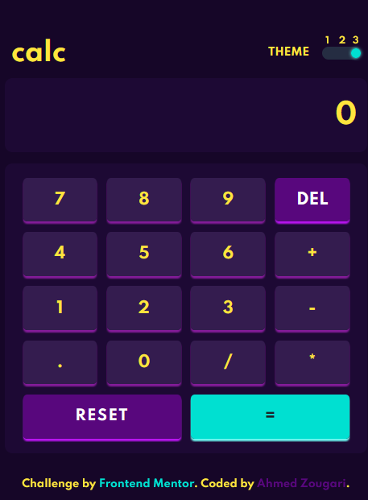

# Frontend Mentor - Calculator app solution

This is a solution to the [Calculator app challenge on Frontend Mentor](https://www.frontendmentor.io/challenges/calculator-app-9lteq5N29). Frontend Mentor challenges help you improve your coding skills by building realistic projects.

## Table of contents

- [Frontend Mentor - Calculator app solution](#frontend-mentor---calculator-app-solution)
  - [Table of contents](#table-of-contents)
  - [Overview](#overview)
    - [The challenge](#the-challenge)
    - [Screenshot](#screenshot)
    - [Links](#links)
  - [My process](#my-process)
    - [Built with](#built-with)
    - [What I practice](#what-i-practice)
  - [Author](#author)

## Overview

### The challenge

Users should be able to:

- See the size of the elements adjust based on their device's screen size
- Perform mathematical operations like addition, subtraction, multiplication, and division
- Adjust the color theme based on their preference
- **Bonus**: Have their initial theme preference checked and have any additional changes saved in the browser

Feature I Add :

- Avoid error syntax by the user (5+++,3\*-/ ...)
- User able also type with the keyboard
- Return Math ERROR when enter a false syntax

### Screenshot



### Links

- Solution URL: [Code](https://github.com/zougari47/calculator-app-main)
- Live Site URL: [Live Demo](https://zougari47.github.io/calculator-app-main/index.html)

## My process

### Built with

- HTML
- CSS (Variables/Flexbox/Grid)
- Mobile-first workflow
- SASS
- JavaScript

### What I practice

This challenge was good practice for CSS Grid and Variables, also Javascript.

Here is code example for changing theme function :

```Js
function changeTheme(id) {
  const currentTheme = themesColor[id]; //copy object(variables) of the theme given

  //lop over the object & change the css variables
  for (const item in currentTheme) {
    document.documentElement.style.setProperty(`--${item}`, currentTheme[item]);
  }
}
```

SASS code of toggle button:

```scss
.toggle__themes {
  background: var(--toggle_background);
  border-radius: 1rem;
  position: relative;
  width: 3rem;
  height: 1rem;
  margin-left: 1rem;
  display: flex;
  align-items: center;
  justify-content: space-between;

  input[type='radio'] {
    display: none;
  }

  label {
    cursor: pointer;
    width: 0.9rem;
    height: 0.9rem;
    background: transparent;
    border-radius: 50%;
    z-index: 5;
    position: relative;
  }

  label:before {
    content: '1';
    font-size: 0.7rem;
    position: absolute;
    top: -0.9rem;
    left: 30%;
    color: var(--screen_text);
  }

  label[for='theme2']:before {
    content: '2';
  }

  label[for='theme3']::before {
    content: '3';
  }

  .circle__btn {
    width: 0.75rem;
    height: 0.75rem;
    position: absolute;
    border-radius: 50%;
    left: 0;
    transition: all 0.8s;
    background: var(--toggle_btn_background);
    box-shadow: 0 0 3px var(--toggle_btn_shadow);
  }
}
```

## Author

- Frontend Mentor - [@zougari47](https://www.frontendmentor.io/profile/zougari47)
- Twitter - [@zougari47](https://www.twitter.com/zougari47)
- codepen - [@zougari47](https://codepen.io/zougari47)
